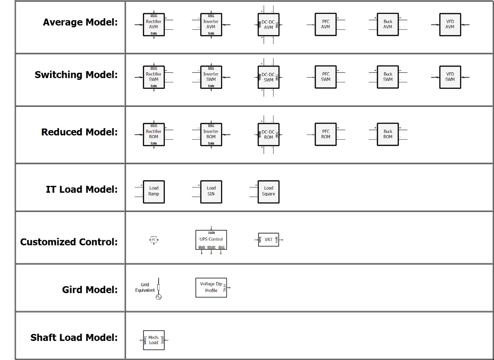
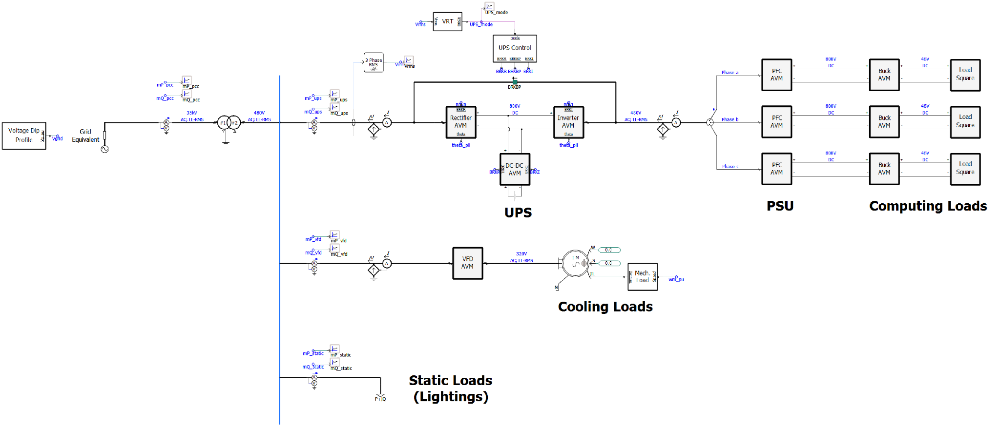

# Generic EMT Modeling of Data Center Load v0 (DC_EMTv0)

**Authors:** Xingyu Zhao, Yingyi Tang, and Junbo Zhao  
**Affiliation:** Dartmouth College  
**Last updated:** September 28, 2026  
**Contact:** [xingyu.zhao.th@dartmouth.edu](mailto:xingyu.zhao.th@dartmouth.edu)

## Overview

This project provides a modular electromagnetic transient (EMT) simulation model of data center loads supplied by a centralized uninterruptible power supply (UPS). It is intended for power system studies of control interactions among power electronic modules and dynamic interactions between the data center and the grid.

The PSCAD library, `DC_EMT_lib.pslx`, includes power electronic converters, IT load profiles, control blocks, grid components, and a mechanical load model. Two example cases demonstrate how to assemble a complete data center model and compare converter models at different fidelity levels.

## Workspace

| Workspace item | Description |
| --- | --- |
| `DC_EMT_ws` | Workspace containing the component library and example projects |
| `DC_EMT_lib.pslx` | Modular data center EMT component library |
| `DC_EMT_demo` | Complete data center example using average converter models |
| `DC_EMT_compare` | Comparison of model responses at different fidelity levels |

## Component Library

*Figure 1. Power electronic modules and supporting components in `DC_EMT_lib.pslx`.*

### Power Electronic Modules

| Module | Average model (AVM) | Switching model (SWM) | Reduced-order model (ROM) |
| --- | :---: | :---: | :---: |
| Rectifier | Yes | Yes | Yes |
| Inverter | Yes | Yes | Yes |
| Battery DC–DC converter | Yes | Yes | Yes |
| Power factor correction (PFC) converter | Yes | Yes | Yes |
| Buck converter | Yes | Yes | Yes |
| Variable frequency drive (VFD) | Yes | Yes | — |

- **AVM:** Represents average converter behavior while retaining circuit and control dynamics.
- **SWM:** Represents switching devices and PWM operation, including switching ripple.
- **ROM:** Simplifies fast dynamics while retaining the outer controls and energy-storage dynamics represented by each module.

Parameters retained in the ROM use the same values as in the corresponding SWM.

### Supporting Modules

- **IT load profiles:** Ramp, sinusoidal, and square-wave demand variations.
- **Control blocks:** PI controller, UPS supervisory control, and voltage ride-through (VRT) control.
- **Grid components:** Grid equivalent and voltage-dip profile.
- **Mechanical load:** Shaft-load model for motor-driven cooling loads.

## Example Cases

### Case 1: Complete Data Center Model (`DC_EMT_demo`)

This case demonstrates how to use the modules in `DC_EMT_lib.pslx` to build a complete data center model for power system dynamic studies. It uses average converter models and includes disturbances on both the grid and workload sides.

*Figure 2. Example data center model with UPS-supplied IT loads, VFD-driven cooling loads, and static lighting loads.*

The simulation sequence is as follows:

1. **Initialization (t = 0–5 s):** The IT load is initialized to 0.6 pu. The cooling load, represented by an induction motor, is brought to its speed setpoint.

2. **Grid-side disturbance (t = 5 s):** A voltage dip is applied at 5 s, and the voltage begins to recover at 6.5 s. This event illustrates the responses of the data center components, particularly the UPS, to the voltage dip and recovery according to the implemented voltage ride-through logic.

3. **Workload-side disturbance (t = 12 s onward):** A periodic square-wave variation is applied to the IT workload to represent power demand fluctuations associated with AI training tasks.

### Case 2: Model Fidelity Comparison (`DC_EMT_compare`)

This case compares the responses of the power electronic modules in `DC_EMT_lib.pslx` at different modeling fidelity levels.

#### IT Loads

The average, switching, and reduced-order models are compared under the following simulation sequence:

1. **Initialization (t = 0–2 s):** The IT load is initialized to 0.6 pu.

2. **Grid-side disturbance (t = 2 s):** A voltage dip is applied at 2 s, and the voltage begins to recover at 2.5 s.

3. **Workload-side disturbance (t = 6 s onward):** A periodic square-wave variation is applied to the IT workload to represent power demand fluctuations associated with AI training tasks.

These disturbances allow the three model variants to be compared under both grid-side and workload-side changes.

#### Cooling Loads

The cooling-load model is initialized during the first 5 s. At 5 s, the voltage-dip profile used for the IT-load comparison is applied to the cooling-load supply. This test compares the responses of the average and switching models to a grid-side disturbance.

Together, these comparisons illustrate how modeling fidelity affects simulated dynamic responses and support model selection for different study objectives.

## Contact

For questions about the model, please contact Xingyu Zhao at [xingyu.zhao.th@dartmouth.edu](mailto:xingyu.zhao.th@dartmouth.edu).
